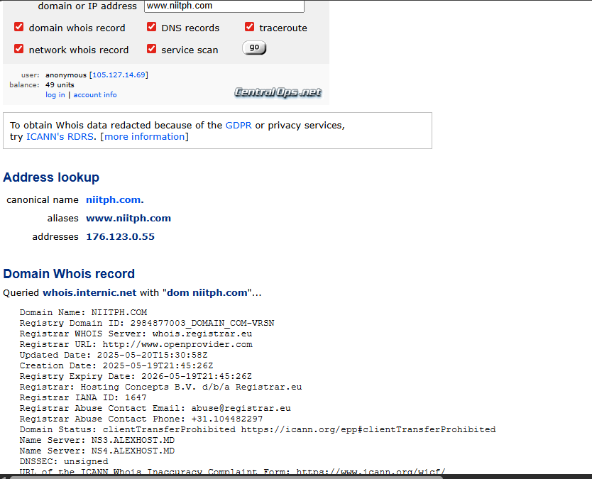
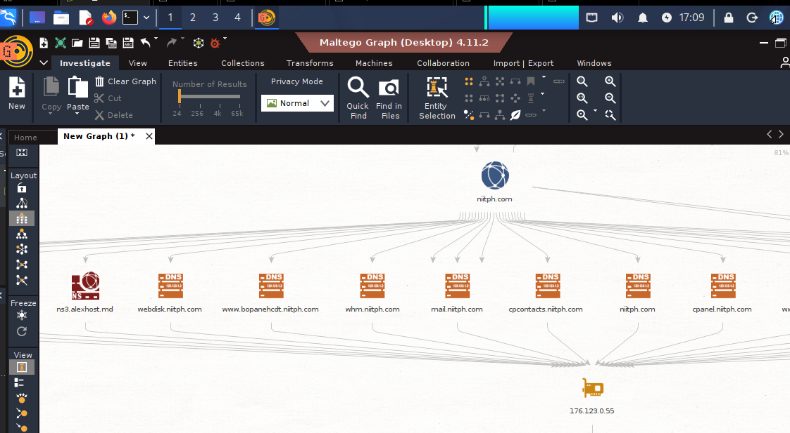
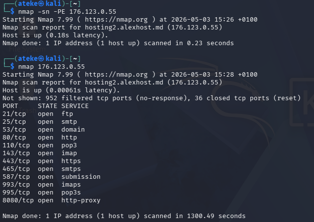

# Enterprise OSINT & Threat Intelligence Assessment

A hands-on Open-Source Intelligence (OSINT) and light network-reconnaissance assessment demonstrating how a threat actor's early reconnaissance phase would look against a real organization — conducted as a training exercise on the **National Institute of Information Technology, Port Harcourt (NIITPH)**, plus a short supporting case study on OSINT information persistence.

> ⚠️ **Responsible disclosure note:** This is a redacted, portfolio-safe version of a full internal assessment. Exact endpoint URLs, staff photographs, and direct personal contact details have been withheld or generalized so this repository cannot be used as a ready-made attack roadmap. The full findings were shared privately with the relevant parties.

---

## 🎯 Objectives

- Identify publicly available information about the target organization
- Assess employee and organizational exposure
- Discover digital assets and infrastructure footprints
- Investigate publicly reachable infrastructure
- Correlate intelligence findings into meaningful conclusions
- Assess security risk based on the collected intelligence
- Produce a professional intelligence report

## 🧰 Tools Used

| Tool | Purpose |
|---|---|
| Google / Bing Dorking | Advanced search-based reconnaissance |
| WHOIS / CentralOps.net | Domain registration & DNS information |
| Wayback Machine | Historical website analysis |
| Maltego | Relationship / infrastructure mapping |
| OSINT Framework | Domain & infrastructure enumeration |
| Nmap | Host discovery & port scanning (Kali Linux) |
| LinkedIn / Instagram | Public employee & organizational profiling |

## 🔄 Methodology

Followed the intelligence cycle for a structured, repeatable process:

**Planning → Collection → Processing → Analysis → Dissemination**

Applied through a three-phase reconnaissance model:
1. **Passive Reconnaissance (OSINT)** — dorking, WHOIS, archives, social platforms
2. **Active Reconnaissance** — Nmap host/port scan against the resolved IP
3. **Enumeration & Correlation** — Maltego transforms tying infrastructure and findings together

---

## 🔍 Key Findings (Summary)

| # | Finding | Risk |
|---|---|---|
| 1 | Organizational domain, contact pages, and staff profiles enumerable via search-engine dorking | Medium |
| 2 | Employee names, roles, and email address patterns discoverable via LinkedIn and site dorking | High |
| 3 | Named senior staff identified with direct email addresses on the public "About Us" page | High (details redacted here) |
| 4 | An internal authentication endpoint was found reachable from the open internet without any access control | High (URL withheld) |
| 5 | Domain registered recently (~1 year old at time of assessment); DNSSEC not enabled | Medium |
| 6 | Site is hosted on a shared IP block alongside multiple unrelated domains | Medium |
| 7 | Multiple network services reachable on the resolved hosting IP (mail, web, and control-panel–related ports) | Medium |
| 8 | Wayback Machine retains a staff profile that had been removed from a separate institution's live website, demonstrating that content removal ≠ content disappearance | Informational |

Full risk ratings, correlation analysis, and remediation recommendations are documented in the internal report.

---

## 🧪 Evidence

*Screenshots below demonstrate technique only. Staff photographs, direct personal contact details, and the exact vulnerable endpoint have been intentionally excluded from this public repository.*

**1. Passive reconnaissance — Google dorking for domain & contact enumeration**

**2. Passive reconnaissance — email pattern discovery**

**3. OSINT Framework — resolving the organization's hosting infrastructure**

**4. WHOIS & DNS record analysis**

**5. Maltego — domain relationship mapping**

**6. Maltego — subdomain & hidden-service enumeration**

**7. Nmap — host discovery and port scan**

---

## 🛡️ Selected Recommendations

- Place any internet-reachable login/authentication portal behind MFA, IP allow-listing, and rate-limiting
- Move individually attributable staff contact details behind role-based/generic addresses where possible
- Enable DNSSEC on the primary domain
- Review and close any network services that don't need to be internet-facing
- Establish a recurring internal OSINT self-assessment to track external exposure over time

---

## 📚 Skills Demonstrated

`OSINT` `Passive & Active Reconnaissance` `Google Dorking` `WHOIS/DNS Analysis` `Maltego` `Nmap` `Threat Intelligence Reporting` `Risk Analysis` `Responsible Disclosure`

## ⚖️ Ethics & Authorization

This assessment was conducted for training/educational purposes. All techniques used were passive, publicly available, or limited to non-intrusive host/port discovery. No credentials were tested, no systems were exploited, and no unauthorized access was attempted.

---

*Part of a broader cybersecurity portfolio — see [profile README](../../) for the full project roadmap (Log Analysis → OSINT → Malware Analysis → Social Engineering → Vulnerability Assessment → Penetration Testing).*
